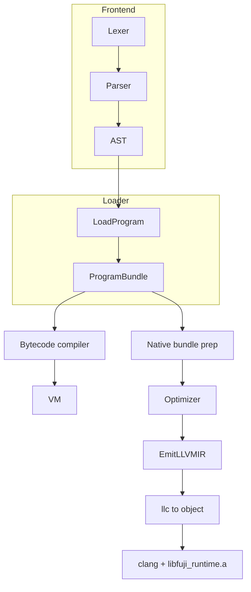

# Fuji implementation handoff

**Audience:** Engineers on the Go toolchain (lexer → AST → bytecode VM + optional LLVM AOT).  
**Programmer-facing syntax + honest feature map:** [FUJI_PROGRAMMER_REFERENCE.md](FUJI_PROGRAMMER_REFERENCE.md).  
**Spec:** [kuji compiler.md](kuji compiler.md) — **Implementation Status** is the language delta vs this repo.

**Stack:** module `fuji` ([go.mod](go.mod)), Go **1.22**, LLVM IR via [llir/llvm](https://github.com/llir/llvm) v0.3.6.

---

## 1. Product

| Command | What it does | Needs beyond `fuji` binary |
|--------|----------------|----------------------------|
| `fuji run` | Load bundle → bytecode → VM + GC | Nothing |
| `kuji check` | Parse + module graph | Nothing |
| `kuji disasm` | Bytecode dump | Nothing |
| `fuji build` | Bundle → LLVM `.ll` → **llc** → `.o` + link **`runtime/libfuji_runtime.a`** | **llc** + LLVM **clang** on `PATH` (or `FUJI_CLANG` / `CC`) |

Ship a static CLI: `CGO_ENABLED=0` — see [RELEASE.md](RELEASE.md).

### Quick start

```bash
go build -o kuji.exe ./cmd/kuji   # Unix: ./kuji
go test ./...

./kuji.exe run path/to/script.fuji
./kuji.exe check path/to/script.fuji
./kuji.exe disasm path/to/script.fuji
./kuji.exe build path/to/script.fuji -o myapp.exe
```

`run` / `check` / `disasm`: [LoadProgram](internal/kuji/loader.go) → compiler / VM. `build`: [EmitLLVMIR](internal/kuji/llvm_emit.go) + clang; driver knobs in §6.

---

## 2. Architecture

One **ProgramBundle** (entry + `import` / `#include` graph). Same AST feeds **two** lowerings: bytecode + LLVM. They do not share IR — semantics must be kept in sync deliberately.



---

## 3. Code map

| Area | Path |
|------|------|
| CLI | [cmd/kuji/main.go](cmd/kuji/main.go) |
| Lexer / parser / AST | [internal/kuji/lexer.go](internal/kuji/lexer.go), [parser*.go](internal/kuji/parser.go), [ast.go](internal/kuji/ast.go) |
| Loader, `FUJI_PATH`, `@` | [internal/kuji/loader.go](internal/kuji/loader.go), [loader_test.go](internal/kuji/loader_test.go) |
| Bytecode + VM | [compiler.go](internal/kuji/compiler.go), [vm.go](internal/kuji/vm.go), [opcodes.go](internal/kuji/opcodes.go), [chunk.go](internal/kuji/chunk.go) |
| Builtins | [internal/kuji/native.go](internal/kuji/native.go) |
| Native / LLVM | [native_emit.go](internal/kuji/native_emit.go), [optimizer.go](internal/kuji/optimizer.go), [llvm_emit.go](internal/kuji/llvm_emit.go), [llvm_emit_abi.go](internal/kuji/llvm_emit_abi.go) (callee ABI / defaults / rest), [llvm_runtime.go](internal/kuji/llvm_runtime.go) |
| C runtime (native link) | [runtime/src](runtime/src) → **`runtime/libfuji_runtime.a`** (see [runtime/Makefile](runtime/Makefile)) |
| Alternate monolithic embed (not default `fuji build`) | [internal/runtime/data/kuji.c](internal/runtime/data/kuji.c), [kuji.h](internal/runtime/data/kuji.h) |
| Tree interpreter (subset, not `run`) | [evaluator.go](internal/kuji/evaluator.go), [runtime.go](internal/kuji/runtime.go) |

---

## 4. Module rules

- Relative `import`: from importer’s directory. `FUJI_PATH`: OS path list. `@` modules: real `.fuji` files only (plus implemented `index.fuji` layouts).
- `#include`: load-time merge; spec forms `as` / `{names}` / `*` are **not** implemented — document or implement in spec + [kuji compiler.md](kuji compiler.md).

---

## 5. VM vs `fuji build` today

| Feature | VM | Native |
|---------|-----|--------|
| Literal default params | Yes | **Aligned** — callee prologue in [llvm_emit_abi.go](internal/kuji/llvm_emit_abi.go); [tests/default_rest.fuji](tests/default_rest.fuji) |
| `...rest` | Yes | **Aligned** — `FUJI_argv_slice_to_array` in [kuji.c](internal/runtime/data/kuji.c); same test |
| `print` spacing | Yes | **Aligned** (runtime helpers + tests) |

[ValidateNativeEmitSupport](internal/kuji/native_emit.go) is a **stub** (always ok) until a future native-only limitation needs a pre-IR gate again.

---

## 6. Native toolchain

1. Emit `main.ll`, run **llc** to `main.o`, then **clang** links `main.o` + **`libfuji_runtime.a`** (+ optional `FUJI_NATIVE_SOURCES`).  
2. Env: **`FUJI_CLANG`** (path), else **`CC`** (e.g. `clang-18`), else `clang`. **`FUJI_USE_LLD=1`** adds `-fuse-ld=lld`.  
3. Only LLVM clang reliably eats `.ll` next to C; other drivers need a future IR/bc precompile path for the runtime.

---

## 7. Plan to finish the compiler

Order is **dependency-first**: parity before advertising native as “full”; loader/tests before big language additions; FFI and tooling after the core story is stable.

### Track 1 — Native parity (required for “compiler done” on the supported slice)

1. **Default parameters in LLVM** — **Done** — same rules as [minArityForParams](internal/kuji/compiler.go) / [VM.padClosureCallArgs](internal/kuji/vm.go); literal defaults only (compiler-enforced).
2. **`...rest` in LLVM** — **Done** — rest slot = `FUJI_argv_slice_to_array(argv, nonRest, ac - nonRest)`.
3. **Gate** — [ValidateNativeEmitSupport](internal/kuji/native_emit.go) currently a no-op; reintroduce diagnostics when the native subset shrinks again.

**Next parity gaps:** grow a shared VM↔native corpus (edge cases: many defaults, rest-only, captured default params); optional `.ll` FileCheck snippets when clang errors are opaque.

### Track 2 — Loader + spec honesty

4. **Loader tests** — Windows vs Unix paths, `@`, angle `#include` in [loader_test.go](internal/kuji/loader_test.go). **Exit:** CI green on targeted matrix where you care.
5. **`#include` subset** — Either implement selective include or keep a single explicit delta in [kuji compiler.md](kuji compiler.md).
6. **`@` policy** — Decide non-`.fuji` artifacts; enforce with tests and errors.

### Track 3 — CI and release

7. **CI clang** — Job with LLVM on PATH running native integration (e.g. `TestCLI_build_hello` without skip). **Exit:** main branch regularly exercises `build`.
8. **Release matrix** — Document `FUJI_USE_LLD`, Apple vs Linux clang quirks in [RELEASE.md](RELEASE.md) as you learn them.

### Track 4 — FFI (language completion vs spec)

9. **Minimal `#native` / `#ffi`** — Lexer/AST, one proof (e.g. `sqrt`): VM + LLVM declare/link. **Exit:** one program runs both ways; then grow marshalling. Defer large KujiWrap / libclang until this is boring.

### Track 5 — Tooling (ship when Tracks 1–2 are solid)

10. **`kuji repl`** — VM-backed read-eval-print.  
11. **`kuji fmt`** — Formatter on a corpus.  
12. **`kuji test`** — Tiny test runner.

### Track 6 — Optional / later

13. **Precompiled runtime** — Embed `kuji.bc` / `.ll` at `fuji` build time so users need not compile C (smaller story change, larger embed).  
14. **Shared lowering** — Only if maintaining VM + LLVM twice becomes the main cost; mid-term architecture, not a blocker for parity.

**Definition of done (suggested):** Tracks **1–3** complete; spec status in [kuji compiler.md](kuji compiler.md) updated; Track **4** done if the spec marks FFI as in-scope for “1.0”.

---

## 8. Verification

```bash
go test ./...
```

Native work: `clang` on PATH or `FUJI_CLANG` / `CC`. Add tests under [internal/kuji](internal/kuji) and [cmd/kuji/main_test.go](cmd/kuji/main_test.go).

---

## 9. Open decisions

- **Parity vs subset flag:** default to parity; introduce `--subset` or similar only if binary size or compile time forces it.  
- **Precompiled C runtime:** embed size vs user-machine compile (Track 6).  
- **`@` beyond `.fuji`:** explicit policy + errors.

Keep the spec’s **Implementation Status** and any root README pointed at this file so contributors have one engineering entry point.
